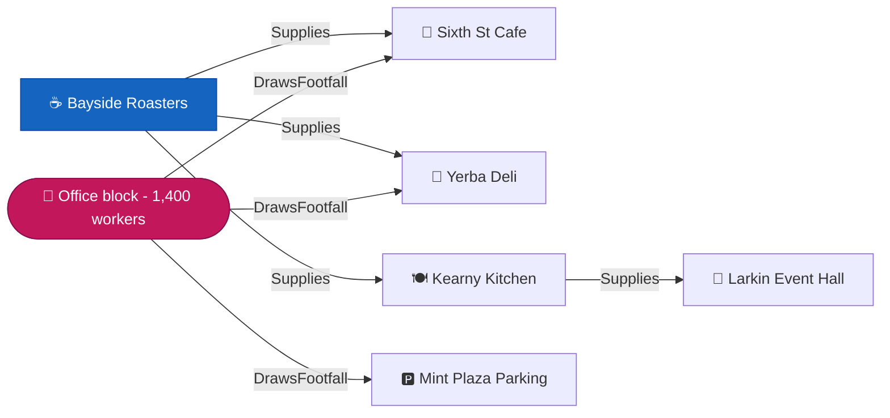

# Challenge 3—Community Economic Resilience & Micro-Grants

**Agents for Impact 2026**

---

## Why this one matters

A hardware store on a commercial street closes. On the balance sheet that is one business, four
jobs, and an empty storefront.

Here is what actually happened.

The lumber supplier two blocks over just lost a steady buyer and is now one bad quarter from
laying somebody off. Three contractors who bought their materials there now drive twenty minutes
each way, which costs them roughly an hour a day they used to bill. The lunch counter on the
corner has lost the weekday trade of those contractors' crews, and a lunch counter runs on
weekday trade. **None of those businesses were in trouble last month. They are in trouble now,
because of a closure nobody connected to them.**

This is what makes small-business relief so hard to do well. The money is genuinely scarce—a city
economic-development office might have fifty thousand dollars and forty applicants—and the
obvious way to allocate it is to rank the applicants by how much trouble they are in. That
produces a defensible-looking list and it is blind to the only thing that makes a local economy
different from forty separate businesses: **they hold each other up.**

**Your job today is to build the thing that can see that**, and argue for a grant on the strength
of what it protects downstream.

You will build it for **one commercial corridor**—a few blocks, not a city. That is not a
simplification. It is the scale at which this problem actually exists.

---

## How to read this

**This is a reference for your whole afternoon, not something to read end to end now.** Here is
what each of you needs in the first fifteen minutes.

| If you are… | Read now | Come back for |
|---|---|---|
| **Everyone, together** | [The five things](#the-five-things-youre-working-with) · [Three tracks](#three-tracks-one-architecture) · [Pick your corridor](#now-pick-your-corridor) | — |
| **Team lead** | [Step 0](#step-0organize-your-team) · [How you'll be judged](#how-youll-be-judged) | [What will set yours apart](#what-will-set-yours-apart)—read it *before* you write code |
| **Data lane** | [Step 4, load the data](#step-4load-the-data) · [What you'll have](#what-youll-have) | [The data, and why we chose it](#the-data-and-why-we-chose-it) · Section 13 of the notebook |
| **Agent lane** | [What you're building](#what-youre-building) · [The technology](#the-technology-youll-use) | [`agent/README.md`](agent/) · [Reference](#reference) |
| **Front end lane** | [Front end lane](#front-end-lane2-people) | [Your output artifact](#your-output-artifact-the-grant-memo) |
| **Story lane** | [Your output artifact](#your-output-artifact-the-grant-memo) | [The data](#the-data-and-why-we-chose-it)—which half is real, because you will be asked |

**Three things everybody should know by the end of hour one**, whatever lane you are in:

1. **Which of your edges are real and which are modeled.** A judge will ask, and the honest answer
   is a good one. It is [here](#the-data-and-why-we-chose-it).
2. **Your agent must genuinely traverse the graph**, multi-hop. A single `JOIN` with "graph" in the
   variable name is the most common way to miss the point while appearing to hit it.
3. **Most businesses have no cascade at all.** That is not a bug—finding the ones that do is a
   large part of what you are building.

---

## The five things you're working with

Small vocabulary, used consistently from here on. Here is one block of a corridor, drawn the way
your data is actually shaped:



*Blue is the business we will trace from. Pink is an **Employer**—a census block with a real
worker count, not a company. Bayside Roasters roasts coffee; Kearny Kitchen is a caterer.*

| Term | In the picture |
|---|---|
| **Node** | Every box. Two kinds: a **Business** (blue and grey) and an **Employer** block (pink). Employers are census blocks with a real worker count, not companies |
| **Edge** | Every arrow, and it has a direction. **`Supplies`** runs supplier → buyer. **`DrawsFootfall`** runs employer → the businesses those workers spend at |
| **Property** | What an edge or node carries. `Supplies` has `intensity`, how much of a buyer's input budget that industry represents. `DrawsFootfall` has `worker_share` |
| **Cascade** | What is exposed when a node fails. Bayside Roasters closing reaches the café, the deli, the caterer—**and then Larkin Event Hall, which never bought a bean from them** |
| **Traversal** | Walking those arrows. `-[:Supplies]->{1,2}` follows the supply arrow one or two steps. That `{1,2}` is the part SQL cannot do |

**The single most important thing about this picture: arrows point from the thing depended upon
toward the thing that depends on it.** Follow an arrow forward and you are tracing *exposure*.
Follow it backward and you are tracing *what this business needs to survive*. Both are legitimate
questions and they give completely different answers, so decide which one you are asking before
you write a `MATCH`.

Notice Mint Plaza Parking. It has one edge in and none out—**a leaf.** Most businesses on a real
street are leaves, because they sell to the public rather than to each other. In the default
corridor only 86 of 230 businesses have anything two hops downstream of them, and finding which
ones is a large part of what your agent is for.

The whole challenge is: **a corridor and a budget in, a defended funding recommendation out, with
the cascade it protects shown.**

---

## Three tracks, one architecture

Every team shares the same spine: one corridor of real businesses, one graph over them, one
multi-hop traversal, one funding argument. **What changes between tracks is the question you
walk into, not the machinery.**

**These are suggestions, not a menu you are confined to.** Pick one, combine two, or invent your
own—if you can see a community-economic-resilience problem in the same vein that these three
miss, that is exactly the kind of judgment this challenge rewards. Just be ready to say why yours
is worth solving.

| Track | The situation | Who your user is | What makes it hard |
|---|---|---|---|
| 🏢 **Main Street relief** | A queue of applicants and not enough money | A city economic-development officer with a fund and a deadline | Every applicant has a real case. You are choosing between sympathetic businesses |
| 🌾 **Micro-producer & supply continuity** | A supplier or small manufacturer is failing, and things depend on it | A community lender or co-op coordinator | The damage is upstream and invisible. Nobody in distress has filed anything yet |
| 🏭 **Anchor closure** | A large employer announced it is leaving in 90 days | The same officer, before anyone applies for anything | **There are no applicants.** The agent has to find who is exposed before they know it |

### Read the picture above three ways—one per track

This is the clearest reason to commit to a track rather than gesture at all three, because each
one enters the graph somewhere different and **one of them changes direction halfway.**

**🏢 Main Street.** Your officer hands you Bayside Roasters as an applicant. Start there, follow
`Supplies` **forward**, and you get the café, the deli, the caterer, then Larkin Event Hall two
hops out. Your argument is what the grant protects downstream.

**🌾 Micro-producer.** Nobody hands you anything, and the roaster has not applied—it is upstream
and quietly fine until it is not. **You have to find it**, by asking which businesses have the most
downstream reach. Same arrows, same direction, but the search *is* the work.

**🏭 Anchor closure.** The office block announces it is leaving. Follow `DrawsFootfall` **forward**
and you reach the café, the deli and the parking operator—they lose their weekday trade.

**Now keep going, because this is the part teams will miss.** Those cafés were Bayside Roasters'
customers. When their trade collapses, the roaster loses its buyers—and that harm travels
**backward** along `Supplies`, against the arrow, to a business that is nowhere near the office
and never had anything to do with it.

So the anchor track is not "the same query in reverse." It runs **forward along one edge type,
then backward along another**, and a team that only ever traverses one way will find the café and
stop. In GQL that second leg is `<-[:Supplies]-`.

---

## What you're building

**A case, not a score.** Not a dashboard of at-risk businesses, and not a ranked list with a
chatbox in front of it—an agent that a grant officer can hand a situation to and get back
something they could take into a meeting and defend.

Your officer is not asking one question. Picture a single afternoon:

> **Tuesday, 2pm.** You have $50,000 in emergency relief funds, eleven applications on your desk,
> and a rumour that the light-industrial building at the end of the block has been sold. You have
> to decide by Friday.

Over the next two hours the same officer asks all of these:

| What they ask | What answers it |
|---|---|
| *"If I fund nobody, which of these eleven closures does the most damage?"* | Multi-hop traversal from each applicant, weighted by what is downstream |
| *"Show me why this one and not that one."* | The actual paths—which businesses, how many hops, how strong the link |
| *"This applicant has four suppliers downstream. Are any of them already fragile?"* | Traversal plus the loan history on the far end |
| *"Nobody at the far end of that chain applied. Should they have?"* | The anchor-closure question in miniature—the graph knows things the queue does not |
| *"What does $8,000 actually change?"* | Nothing in the data answers this. **You have to say what you are assuming** |
| *"Whose neighborhood does this help?"* | Census tract demographics for the businesses you chose |
| *"Write it up. I present Friday."* | Gemini, assembling the memo from everything above |

Notice these need **different things**. Some need the traversal. One needs only a lookup. One
needs the agent to admit the data cannot answer it—and **an agent that says "here is what I am
assuming, and here is how the answer changes if I am wrong" is worth more than one that invents a
number.**

**That range is the challenge.** An agent that answers only the first question is a centrality
calculator. An agent that handles all seven is something an officer would keep open all week.

### Questions that need more than we gave you

Be aware of the edges—and treat them as opportunity, because closing one is exactly what
separates a team.

| The question | What you'd need to add |
|---|---|
| *"Is this business actually behind on rent?"* | Nothing public exists. Commercial lease and arrears data is private everywhere |
| *"Who owns the building?"* | Assessor parcel data. Public in most counties, license varies—check before you load |
| *"Is the street about to be dug up for two years?"* | Municipal capital-projects and permit feeds. Several cities publish these |
| *"Has this business been cited, inspected, or shut down before?"* | Health and building inspection datasets. Widely published, often license-clean |
| *"How far is that supplier really—by road, not straight line?"* | Google Maps routing. We give you coordinates and straight-line distance |
| *"Which of these businesses are minority- or woman-owned?"* | Certification registries exist per city. **Read the bias section before you use them for ranking** |
| *"Did the businesses my model calls fragile actually fail?"* | You already have this. The SBA loan records include real charge-offs. Very few teams will notice |
| *"How many **jobs** does this business support?"* | **Nothing public has it.** Per-business employment is not published for small businesses anywhere in the US—the Census publishes counts by area and industry, never by business. Your cascade can count *businesses* exposed, not jobs. Closing this with your own source is a real contribution |

---

## Now pick your corridor

**This is not a universal application. It is an application for a few blocks**, and choosing
which blocks is the first real decision your team makes.

**You do not have to pick the city you are sitting in—but you do have to pick from this list.**
This challenge runs on **San Francisco**, and on Los Angeles if you supply your own bounding box.
Not Toronto, not New York, not the city outside the window. The reason is in
[the data section](#the-data-and-why-we-chose-it): we need a business registry that publishes an
industry code under a license we can actually use, and very few cities do both.

San Francisco does something unusually useful here: **the City assigns every registered business
to a named commercial corridor**, so you are not drawing a boundary and defending it. These are
the City's own designations.

| Corridor | Businesses | Industries | Suppliers with depth | Tracts | Poverty |
|---|---:|---:|---:|---:|---:|
| **Central Market** | 230 | 65 | **86** | 7 | **22%** |  ← the default
| **Chinatown** | 413 | 71 | 37 | 9 | — |
| **Market/Castro** | 314 | 62 | 57 | 8 | — |
| **Mission Street** | 174 | 50 | 35 | **20** | — |
| **Union Street** | 153 | 39 | 41 | 5 | — |
| **North Beach** | 148 | 35 | 18 | 4 | 13% |
| **Parkside Taraval** | 109 | 38 | 19 | 4 | — |
| **24th St** | 98 | 33 | 22 | 5 | — |
| **Geary Boulevard** | 92 | 29 | 17 | 5 | — |
| **West Portal** | 90 | 36 | 14 | ⚠️ 1 | — |

Every number was **measured from the published snapshot on 2026-08-09**, not estimated. These are
counts *after* we remove sole proprietors and home-address registrations, which is most of what the
City publishes—Chinatown's 1,909 listings become 413 businesses. The section on
[the data](#the-data-and-why-we-chose-it) explains why.

**Read the third column before you choose, not the first.** "Suppliers with depth" counts
businesses that have anything **two hops** downstream of them, and it decides whether a cascade
query returns something interesting or an empty set. **It does not track size.** Central Market has
*half* Chinatown's businesses and **more than twice** as many with real downstream reach. If you
take one thing from this table, take that: you cannot tell which businesses hold a neighborhood up
by counting how many there are. That is the entire challenge, visible before you write any code.

**Notice how small that column is everywhere.** In North Beach, 18 of 148 businesses have a two-hop
cascade. That is not a data problem—most businesses on a commercial street sell to the public, not
to each other. **Finding which of your applicants actually hold something up is a large part of what
your agent is for**, and a grant officer with forty applications has no way to know.

**The last two columns matter for your equity audit.** With a single census tract, West Portal
cannot support an audit at all—there is nothing to compare against. Central Market combines the
most graph depth with the highest-need tracts in the set, which makes it the most interesting place
to ask whether the money went where the need is.

**Third Street is deliberately absent.** It yields 40 businesses, below the floor, and almost no
graph structure. Appendix B will tell you the same thing if you try it.

**All ten are tested and available both ways**—the notebook builds any of them live, and
`scripts/load.sh` has all ten pre-built for when the notebook will not run.

**You may use another San Francisco corridor**; the City publishes 27. But only these ten are in
the snapshot, so if you pick a different one **the notebook is your only path**—the fallback will
not have it. **Appendix B of the notebook** measures any corridor in about a minute and tells you
plainly whether it is worth an afternoon. Most of the other 17 are too small, which is why they are
not here.

**The number that decides whether your graph is interesting is not the business count. It is the
industry variety.** Supply edges exist only between industries that trade with each other, so 300
businesses across 40 industries produces a far richer network than 500 that are all restaurants.
**Appendix B of the notebook** works this out for any corridor and tells you plainly whether it
is worth building on.

**Los Angeles also works** and is the second tested city—it has no corridor column, so you give a
bounding box instead. Any US city with an open, license-clean business registry will work in
principle, but only these two are tested.

> **Why not Chicago or New York?** We checked both. Chicago's business license file has no NAICS
> industry code, and every supply relationship in this challenge comes from an industry-to-industry
> lookup—so there is nothing to join on. New York's open data portal states no license at all for
> its business files, and absence of a license grants no rights. Both are good datasets that
> happen not to fit. It is a useful illustration of the difference between *available* and
> *usable*.

Then make the scenario your own:

> *"We run relief funding for ______. ______ just closed / is about to close, and we have $______
> to spend. Here is who we think is exposed, and here is what we do not know."*

Write it down before you write code. Every design argument you have this afternoon resolves faster
against a specific situation than a general one, and it is the sentence your demo opens with.

---

## The technology you'll use

Every team, every challenge, uses the same core stack:

| | |
|---|---|
| **ADK** (Agent Development Kit) | You build your agent in Python with ADK. This is the frame everything hangs on |
| **Gemini** | The reasoning model—weighing two viable grants, and writing the memo a human will sign |
| **BigQuery** | All the data lives here, and your agent queries it |
| **A managed MCP server** | Consume at least one—don't author your own. See below |
| **At least one tool you built** | A Python function tool, or one you defined in MCP Toolbox |
| **Deployed to Google Cloud** | Agent Runtime or Cloud Run, your choice. It has to actually run somewhere |

**Also already installed and worth ten seconds now rather than later: the Antigravity CLI.** Type
`agy` in Cloud Shell and you have a terminal coding agent that reads your repo, proposes edits,
and runs commands. Not required, nothing here depends on it, but every lane has tedious work it
would happily absorb.

### Choosing your MCP server

- **BigQuery's built-in MCP server**—quickest path if all you need is to query your tables.
- **[MCP Toolbox for Databases](https://github.com/googleapis/mcp-toolbox)**—Google's open source
  MCP server for databases. Prebuilt tools plus a framework for defining your own.

**The Toolbox is generally more flexible.** If you want your agent's database access shaped to
your own tools rather than generic queries, start there.

> **Hint worth taking:** run the Toolbox as a container on **Cloud Run with minimum instances set
> to 1**. Cloud Run scales to zero by default, so the first request after an idle period pays a
> cold start—and the first request after an idle period is the one you make on stage.

### And one required differentiator: **BigQuery property graphs**

Each of the five challenges has one required technology. Yours is the property graph, queried
with **GQL**, and here is why it belongs in this problem rather than being bolted on.

Look at the question again: *if this business closes, what else is exposed?*

One hop is easy. `SELECT ... JOIN` gives you everyone who buys directly from it. Two hops is
another JOIN. Three is another. **And you have to know how many hops before you write the
query**—which means you have already decided the answer's shape before you asked the question.

A cascade does not work like that. The whole point is that you *don't* know how far the damage
travels, and the interesting cases are the ones where it travels further than anyone expected.

In GQL that is one clause:

```
MATCH p = (seed:Business)-[:Supplies]->{1,3}(exposed:Business)
```

`{1,3}` means *one, two or three hops—give me everything reachable.* The depth becomes a
parameter instead of a rewrite. That is the actual technical difference, and it is why this
belongs here.

**Your agent must genuinely traverse.** A single-hop `MATCH`, or a `JOIN` with the word graph in
the variable name, does not count—and it is the most common way a team misses the point while
appearing to hit it.

**But the traversal is not the answer, and this is what most teams will miss.** The most connected
business in your corridor is not automatically the best investment. It may be the most *robust*
one—everybody depends on it precisely because it is not going anywhere. A graph makes a
consequence **visible**. Deciding what that consequence is worth, and what a grant actually
changes, is where your agent earns its score.

---

## Getting started

You have **4.5 hours** and there are **8–10 of you**. That is too many people for one keyboard,
and the biggest risk to your team is the first hour disappearing into setup. Spend twenty minutes
on Step 0. It pays for itself twice over.

### Step 0—Organize your team

**Pick a team lead.** One person who makes the call when you are behind—and you *will* be behind.

**Pick a repo owner.** Can be the same person. They create the team's repository and add everyone.
Everything lands in one repo, not eight forks.

**Everyone else: create a free [GitHub](https://github.com) account now** if you don't have one,
and **send your username to the repo owner** while they're setting up.

**Agree your corridor, your track, and your scenario** (see above). Five minutes. Write it where
everyone can see it.

**Then spend ten more on [What will set yours apart](#what-will-set-yours-apart).** It sits near
the bottom because it only makes sense once you know what you are building—but it decides whether
your demo looks like everyone else's, so read it before you write code rather than after.

**Split into four lanes.** All four start immediately, in parallel.

#### Data lane—2 to 3 people

Running the notebook takes a few minutes, so that is emphatically *not* the job. This lane owns
everything between raw tables and a cascade query the agent can call:

- **Create the property graph.** `CREATE PROPERTY GRAPH` over the node and edge tables. **Do this
  first**—the agent lane is blocked until it exists. This is the equivalent of training a model in
  other challenges: an *input* to the agent, not a step 4.
- **Decide what goes in the graph.** We give you three edge types. Should all three be in it?
  Should footfall and supply edges be the same label or different ones? This is a real design
  decision and it changes every query downstream.
- **Write the cascade query.** Multi-hop, with a stopping rule. How deep, and why?
- **Decide how to weight a path.** Multiply intensities along it? Take the weakest link? Count
  the count at the far end? These give different answers and all are defensible.
- **Improve the edge generator.** Ours is deliberately simple—industry match plus walking
  distance. Beating it is one of the highest-value things available today.
- **The equity audit** ([explained below](#what-auditing-the-outcome-actually-means)).
- **Hand the agent lane a working query early.** They need the exact SQL their tool will wrap.

#### Agent lane—2 to 3 people

- **Prompt engineering.** Expect this to be the hardest part. Your system instruction has to teach
  the agent who it is talking to, when to reach for which tool, and—importantly—**when to refuse.**
  An agent that confidently recommends a grant based on a path it cannot explain is worse than one
  that says "I can't distinguish these two applicants with the data I have."
- **At least one tool you built.** Required. The obvious one wraps the cascade query. The more
  valuable one holds the judgment: what counts as exposure, how to weight, how to assemble the memo.
- **Decide what goes through MCP and what needs a custom tool.** Generic "query my tables" fits the
  managed server. The cascade, with its depth rule and weighting, usually wants a purpose-built
  tool. **This is your main coordination point with the data lane.**
- **Deploy early, not at the end.** The front end is blocked on a live endpoint, and deployment
  always takes longer than you think.
- **Decide what failure looks like.** What does your agent say when the applicant has no edges at
  all? When two applicants are indistinguishable? When the whole budget cannot save anyone?

#### Front end lane—2 people

Three routes. **Pick deliberately and be ready to say why**—the choice tells judges who you think
the user is.

| Option | Strength | Trade-off |
|---|---|---|
| **`adk web`** | Fastest. Built in. Works immediately, and where you should start | Obviously a developer tool. Fine while building, weak as a product story |
| **Gemini Enterprise** | Polished, almost no front-end code. An agent on Agent Runtime can be surfaced through it | Serves **internal** users, not the public |
| **Custom web UI** | Full control. A funding queue showing the cascade behind each decision beats a chat log | The most work by far. Scope it small |

**Everybody starts on `adk web`, and you should too.** The question is whether you *finish* there.
Shipping it as your demo is a choice you will have to defend, and "it was already there" is the
weakest version of that answer.

The Gemini Enterprise trade-off is worth thinking about rather than working around. Your user *is*
internal—a grant officer at a city agency, not a member of the public. **Say that on purpose.**

- **Do not wait for a working agent.** Mock the response, build against it, swap later.
- **If you show the graph, show a small piece of it.** The visualisation caps at 2 MB in a
  notebook, and a wide traversal renders as an unreadable hairball. One cascade from one business
  is legible and makes the point. The whole corridor does not.
- **Whatever you build, the demo runs on it.** Test it on the machine you will present from.

#### Story lane—1 to 2 people, starting at minute zero

Not "make slides at the end." This lane owns whether anyone understands what you built.

**What you're preparing: a short pitch deck and a quick demo.** Presentation time at this event is
tight—your facilitator will give you the number, but plan for short. **A crisp pitch with one
moment that lands beats a thorough walkthrough nobody has time to hear.**

- **The pitch deck.** Short. The problem, your scenario, what your agent does, what you found,
  what you'd do next. Front-load it—assume you get cut off before your last slide.
- **The demo.** Pick one cascade that best shows what your agent can do, and **rehearse it.** Have
  a screenshot ready in case the live version misbehaves.
- **The Grant Memo**—your output artifact (see below). Something an officer would actually receive.
- **The honest limitations.** Judges explicitly reward this. One line in the deck is enough.
- **Know which of your edges are real and which are modeled.** You will be asked. The answer is
  in the notebook and it is a good one—make sure whoever presents can give it.

Time the whole thing out loud at least once. Teams almost always run long.

### Your output artifact: the Grant Memo

Whatever else your agent does, it should produce this—something an officer could take into a
meeting on Friday without asking a follow-up question:

- **Which business**, by name and address, and **how much**
- **What it protects**—the cascade, named: which businesses, at what distance in hops, and how
  strong each link is
- **The traversal itself**, shown. Not described—shown
- **Why this one and not the runner-up.** There is always a runner-up, and the comparison *is* the
  argument
- **What you are assuming.** A grant changes a probability, not an outcome. Say what you think it
  changes
- **Which parts of the evidence are modeled**, in one honest line
- **Who the neighborhood is**—tract demographics for where the money lands

### Step 1—Create the team repository

**Repo owner only.**

1. At the top of this page, click the green **Use this template** button → **Create a new
   repository**. *(No button? Use **Fork** and tell a coach.)*
2. Name it after your team, choose **Public**, click **Create repository**.
3. **Settings → Collaborators** → add every teammate's GitHub username.
4. Paste the repo URL where everyone can see it.

### Step 2—Get into your Google Cloud project

**Your facilitator will tell you how to access your project. Follow those instructions**—they vary
by venue and they're the fastest path.

**There is one project per team.** You all share it, which is the point—you can all see the same
BigQuery tables and the same property graph. It also means you can overwrite each other. Agree on
who creates what.

You have Owner. You don't need to create a project, set up billing, or download a key file.

### Step 3—Everyone: get into Cloud Shell

**Cloud Shell is where you'll work.** It has `gcloud`, `bq`, Python, Node, git, Docker, and the
Antigravity CLI already installed. Nothing to set up on your laptop, no admin rights needed.

1. In the Google Cloud console, click the **terminal icon (`>_`) in the top right**. Use that icon
   rather than a bookmark or typed address: it opens Cloud Shell attached to *this* project, in
   *this* browser session. Typing a URL can land you in a different window signed in as a
   different account, which is a confusing twenty minutes nobody needs.

2. Clone your team's repository:

   ```bash
   git clone https://github.com/YOUR-TEAM/YOUR-REPO.git
   ```

3. Open the whole repo in the editor:

   ```bash
   cloudshell workspace .
   ```

New to any of this?
[Using Cloud Shell](https://cloud.google.com/shell/docs/using-cloud-shell)
·
[Cloud Shell Editor overview](https://cloud.google.com/shell/docs/editor-overview)

One thing worth knowing: your `$HOME` directory persists between sessions. Anything outside it
does not—so keep your work in the cloned repo.

**One repo, one branch per lane.** You are four lanes working in parallel in a single repository,
and if everyone commits to `main` you will spend part of your afternoon resolving conflicts
instead of building:

```bash
git checkout -b agent      # or data, frontend, story
```

#### Optional but encouraged: the Antigravity CLI

**`agy` is already installed in Cloud Shell.** You run zero setup commands—just type it.

Google would like you to try it. It is **not a requirement**, so don't lose time fighting it if it
isn't helping. But it's a genuinely capable terminal coding agent: it reads your codebase, proposes
edits with your permission, and runs commands for you.

```bash
agy
```

Where it tends to earn its keep here: scaffolding ADK boilerplate, drafting a Cloud Run deploy,
and—particularly—**writing GQL**, which most people have never seen before today.

`/diff` shows pending changes before you accept them, `/permissions` controls what it can do on its
own. Review before you accept.

[Docs](https://antigravity.google/docs/cli/install)
·
[Hands-on codelab](https://codelabs.developers.google.com/antigravity-cli-hands-on)

### Step 4—Load the data

**Data lane's job.** One person runs it; nobody else waits.

1. In the Google Cloud console, search for **Colab Enterprise** and open it.
2. **You'll be asked to enable some APIs. Say yes.** Then the Colab Enterprise home page shows
   *another* **Enable APIs** button at the top. Click that too. Two prompts is expected—it isn't an
   error and you haven't done anything wrong.
3. **My Notebooks** → **Import** → source **URL**, and paste this:

   ```
   https://raw.githubusercontent.com/haggman/A4I2026-challenge-3-micro-grants/main/notebooks/c3_01_load_explore.ipynb
   ```

4. Click **Import**, open the notebook, set `CORRIDOR` at the top, and run the cells top to bottom.

**Read the text between the cells.** Several explanations will save you time later, and one of
them—which of your edges are measured and which are modeled—is something judges will ask you
about directly.

**If the notebook won't run**, there's a headless fallback. From the repo root in Cloud Shell:

```bash
bash scripts/load.sh central-market
```

```bash
bash scripts/load.sh --list       # every corridor we've published
```

**One asymmetry worth knowing.** The notebook builds your data live, so it works for *any*
corridor. The fallback loads a pre-built snapshot, so it only covers what we published in advance.
If your corridor isn't there and the notebook won't run, tell a coach rather than switching
corridors to suit the tooling.

Invoke it with `bash` rather than `./scripts/load.sh`—that way it doesn't matter whether the file
arrived with its executable bit set.

It's safe to run more than once. Every table is fully replaced rather than appended to.

### What you'll have

Six tables in your project, in a dataset called `a4i_econ`. **Two are nodes and three are edges**,
and that division is exactly what `CREATE PROPERTY GRAPH` expects:

| Table | Role | What it is |
|---|---|---|
| `businesses` | **node** | Every business in your corridor that survived our filters—name, address, coordinates, NAICS industry |
| `employer_blocks` | **node** | Workplace census blocks with real job counts. These are what "closes" in the anchor-closure track |
| `supplies` | **edge** | Business buys from business, weighted by BEA purchase intensity |
| `draws_footfall_from` | **edge** | Workers at a block spend at nearby businesses. `worker_share` is that business's share of the block's workers |
| `borrowed_from` | **edge** | Business borrowed from a named bank—**including whether the loan was charged off** |
| `tract_demographics` | attributes | Poverty, vehicle access and assistance rates by census tract |

---

## The data, and why we chose it

**Be clear about this, because you'll be asked and the honest answer is a good one.**

**The businesses are real.** Every node is a genuine registered business, published by the City of
San Francisco with its real name, real address, real coordinates and real industry code, under the
Open Data Commons **Public Domain Dedication and License**. We do not invent businesses.

**The corridor is real.** The City assigns each business to a named commercial corridor. We use
that boundary rather than drawing our own.

**Two of the connections are real.** Which bank lent to which business, and which brand a business
is franchised to, come from the **SBA's 7(a) and 504 loan records**, published under FOIA as a work
of the US government. So does something more valuable: **which of those loans were charged off**,
meaning the business actually failed.

**Expect this layer to be sparse—a handful of businesses per corridor, sometimes one.** SBA 7(a)
lending is not common, and matching a loan record to a registry record depends on both files
spelling the business the same way. That is not a defect to work around; it is the honest yield of
joining two government files that share no identifier, and the notebook reports the count at every
stage of the join so you can see exactly where the rows went. Treat these edges as high-value
evidence where they exist rather than as a backbone.

**Two of the connections are modeled, and here is the sentence that matters:**

> **The relationship *types*, and their *industry-level average intensities*, are measured and
> published by the federal government. The assignment of those averages to specific pairs of
> businesses is ours—a modeling choice, not a measurement.**

The Bureau of Economic Analysis publishes, from survey and tax data, how much every industry buys
from every other. That a restaurant spends a measurable share of its input budget with food
wholesalers is a **published federal statistic**. That *this* restaurant buys from *that*
wholesaler is **ours**. Same for footfall: the Census LEHD program publishes how many people work
in each city block, by industry sector—that number is real. Which shops those workers patronise is
our allocation.

The generator is in `data/bea_direct_requirements.csv` and two constants in the notebook. **Read
it.** There is no randomness and nothing hidden, which means you can inspect it, argue with it, and
improve it—and improving it is one of the best add-ons available today.

**The need signal is real.** American Community Survey, via BigQuery public datasets.

### What we deliberately excluded, and why this challenge is different

Every challenge in this pack excludes race and ethnicity as a **model input** and requires them
instead as an **audit of the output**. This is consistent with Google's own responsible-AI
guidance. The reasoning: race genuinely does correlate with which corridors get disinvested—the
redlining literature is not ambiguous—but the correlation is a **proxy**. The causal variables are
economic and structural, and those we can measure directly.

**But your challenge has a second, sharper bias that has nothing to do with demographics, and we
would rather tell you than have a judge find it.**

A business gets supply edges when BEA says its industry buys from another industry present in your
corridor. **So businesses in input-heavy, well-represented industries accumulate edges, and
businesses in service-light or unusual industries accumulate almost none.** A restaurant buys from
everyone. A barber shop buys from almost nobody.

Your cascade will therefore favor restaurants and light manufacturing over personal services—**not
because they matter less to the neighborhood, but because our edge generator can see them
better.** That is a mechanical bias baked into data we handed you. Finding it in your own output
and reporting it is a better result than an audit that came back clean.

We also removed two categories of business before you ever saw them: **sole proprietors and
home-address registrations**, because a great many small businesses are registered in a person's
own name at their own apartment, and that does not belong in a public demo. The notebook prints
exactly how many rows each filter removed. **It is a large number and the filter is blunt**—if your
team wants to argue for a different line, do, and say why.

### What "auditing the outcome" actually means

Three steps, about twenty minutes, and most teams will skip it.

1. **Run your allocator** across the corridor and collect the businesses it would fund.
2. **Compare their industries** to the corridor's overall industry mix. Are you funding restaurants
   at three times their share?
3. **Compare their tracts** to the corridor average on poverty and vehicle access.

Then say the answer out loud: **did the money go where the need is, or where our edge generator
happened to have the most data?**

---

## Going further

Everything above is what your agent has to do. Everything below is optional, and it is where the
difference between two teams actually shows up.

### What will set yours apart

Every team gets the same corridor, the same graph, the same technology. **The core is not where
you win.** Spend fifteen minutes deciding what *your* version does that nobody else's will:

- **Check your prediction against real failures.** You have SBA charge-off records—actual
  businesses that actually failed. Do the ones your model calls fragile look like the ones that
  did? **Almost nobody will notice this data is in there**, and it is the only ground truth
  available in the whole challenge.
- **Beat our edge generator.** Ours is industry match plus walking distance. Add anchor tenancy,
  street-level adjacency, business age, or anything else defensible—and *measure* whether it
  changed the recommendation.
- **Handle the second-order case.** Everyone will trace one cascade. Almost nobody will ask what
  happens when you fund business A and business B fails anyway—does your recommendation change if
  you assume one loss is unavoidable?
- **Say what the money does.** A grant changes a probability. A team that states its assumption
  explicitly and shows how the answer moves if the assumption is wrong is doing something most
  teams will not attempt.
- **Split the budget.** $50,000 into one grant or five? The graph has an opinion and it is not
  obvious.
- **Take the equity audit seriously** instead of as a footnote. The structural bias described above
  is probably in your output right now.
- **Bring a dataset nobody else has**—parcel ownership, capital-projects schedules, inspection
  history. (See below—check the license first.)

Read [how you'll be judged](#how-youll-be-judged) *before* you decide. It's at the bottom, it takes
two minutes, and it will change what you build.

### The add-on we'd build if we had another four hours

The data section admits something: **two of your three edge types are modeled, because no public
dataset in the United States records that one local business supplies another.** We looked hard.
It does not exist.

So build the thing that asks.

**An intake agent.** A business owner talks to it, and it produces the edges. Not a form—a
conversation. Because a form gets you *"we have suppliers,"* and an agent hears *"we get produce
from the place on the corner twice a week and everything else from a truck out of Oakland"* and
asks the follow-up that matters: **is the corner place replaceable?** That single distinction
changes half the cascades in this challenge, and no dropdown will ever capture it.

Why this is worth your time rather than just worthy:

- **It closes the loop on our stated limitation.** We told you the data doesn't exist. You went and
  got it. That is a very strong thing to say in a demo.
- **Its output feeds your differentiator directly.** The agent writes edges. Add them to the edge
  table and the graph is richer immediately—a business can describe its suppliers and see its own
  cascade change in the same demo.
- **It is cheaper than it looks.** A handful of writes with nobody competing for the same row, so
  appending to BigQuery is fine.

---

## Bringing your own data

**You're not limited to what we provide.** If your team knows a dataset that would make this
better, bring it. Thoughtful sourcing is exactly the judgment this challenge rewards.

**Augment, don't replace.** Get the core working first. "Let's find better data" is one of the most
reliable ways to lose ninety minutes and have nothing to demo.

**Check the license before you load it.** This is a publicly branded event and winning projects get
promoted. Anything you bring has to clear the same bar we applied to ourselves:

| | |
|---|---|
| ❌ No **NonCommercial** (NC) | Winners are promoted commercially |
| ❌ No **NoDerivatives** (ND) | Building on the data is the whole point |
| ❌ No **share-alike** (ODbL, CC BY-SA) | It would encumber what *you* build |
| ❌ No **individual-level personal data** | Aggregate public statistics only |
| ❌ No **unstated license** | No license means no rights granted |
| ✅ Public domain, CC0, US Government works | Safe |

**The trap most likely to catch you on this challenge:** commercial business-data providers—the
ones that come up first when you search for supplier relationships—are **all proprietary**, and
several offer a free tier that looks usable until you read the terms. We checked; that is why we
are generating supply edges from BEA rather than buying them. **OpenCorporates is out** for the
same reason. If you're unsure, ask a coach.

**And one that's specific to you:** business registries name real businesses at real addresses, and
some of those addresses are people's homes. We filtered ours. If you bring another registry, think
about whether you have done the same.

---

## What's in this repository

```
notebooks/c3_01_load_explore.ipynb   The main artifact. Run this first.
scripts/load.sh                      Headless fallback if Colab is unavailable.
scripts/fetch_bea.py                 Maintainers only. Regenerates the BEA file.
data/bea_direct_requirements.csv     The published purchase rates behind every
                                     supply edge. Read it - you should be able to
                                     inspect generated data.
data/bea_naics_concordance.csv       How BEA industry codes map to NAICS.
agent/                               Empty. Your agent goes here.
```

`agent/` is empty on purpose. We built the on-ramp—a real corridor, real businesses, one fully real
relationship, two modeled ones with their sources named, and validation that tells you plainly
whether any of it is wrong. We didn't build the vehicle.

---

## How you'll be judged

**"Finished" is not the goalpost.** Almost nobody completes everything they set out to do in 4.5
hours—that's the design, not a failure. A team that gets three quarters of the way with clear
reasoning and honest limitations will beat a team that demos something polished and hollow.

| Dimension | Weight | The question judges are asking |
|---|---:|---|
| **Impact & insight** | 30 | Would a grant officer actually use this? Is the recommendation specific enough to act on? |
| **Technical execution** | 30 | Does it work, and is the graph genuinely traversed rather than name-checked? |
| **Rigor & judgment** | 25 | Can you defend the decisions you made along the way? |
| **Craft & communication** | 15 | Does the short pitch land, does the quick demo work, can you justify your interface? |
| **Bonus—range** | **+10** | Technology breadth and ambition that *serves* the solution |

Bonus sits **on top** of the 100, so ambition can't cannibalise the core. Nail the fundamentals and
add nothing, and you can still win. Wire up five services with no coherent recommendation, and you
can't win on breadth alone.

### What "Rigor & judgment" actually means

This is the one teams under-invest in, because it's least visible in a demo. It's a quarter of your
score and the easiest place to stand out. Four concrete things:

**Data decisions you can defend.** Which of your edges are real and which are modeled? (You were
told. Make sure whoever presents knows.) If you brought your own dataset, do you know its license?

**Validation.** Did you check your tables before building, or assume no error meant no problem? The
notebook ships a validation section—using it, and saying what it told you, counts. One of its
checks exists because BigQuery does **not** verify that graph element keys are unique, and
duplicates silently multiply your paths rather than raising an error.

**Bias handling.** Did you run the [equity audit](#what-auditing-the-outcome-actually-means)? Did
you find the industry bias we warned you about? Bring the numbers, not the intention.

**Knowing what your system can't do.** Two of three edge types are modeled. The footfall locations
are approximate to census tract. A grant changes a probability, not an outcome. A team that
volunteers its limitations shows more skill than one that oversells—and judges are told to reward
it.

One warning worth internalising: **if your agent always recommends the most connected business, you
have built a centrality calculator, not a grant advisor.** The hub is often the most robust node in
the network. A judge who asks "when does your agent *not* fund the biggest hub?" should get an
answer.

### A note on decisions generally

Several places in this challenge ask you to choose rather than follow instructions—which corridor,
which track, how deep to traverse, how to weight a path, what to cut when you're behind. **None of
those have a single right answer, and judges are not checking them against a key.** They're asking
whether you made the choice on purpose and can say why.

---

## Reference

Bookmark the first two; they are the ones you will need today.

**Your differentiator**
- [Introduction to BigQuery Graph](https://cloud.google.com/bigquery/docs/graph-overview)—start here
- [Create and query a graph](https://cloud.google.com/bigquery/docs/graph-create)—the DDL, worked
- [Graph query overview](https://cloud.google.com/bigquery/docs/graph-query-overview)—`MATCH`, quantifiers, `NEXT`
- [Graph schema best practices](https://cloud.google.com/bigquery/docs/graph-schema-best-practices)—element keys, labels, properties
- [Visualize graphs](https://cloud.google.com/bigquery/docs/graph-visualization)—the `TO_JSON` rule
- [GQL functions](https://cloud.google.com/bigquery/docs/reference/standard-sql/graph-gql-functions)
- [Fraud detection codelab](https://codelabs.developers.google.com/codelabs/fraud-bigquery-graph)—a full worked example on other data

> ⚠️ **Check the URL says `/bigquery/`.** Spanner Graph uses nearly identical GQL, looks identical,
> and has functions BigQuery does not (`IS_ACYCLIC`, `IS_TRAIL`, `PROPERTY_EXISTS`). Its docs rank
> highly and will waste your afternoon.

**The rest of the stack**
- [Agent Development Kit](https://google.github.io/adk-docs/)
- [MCP Toolbox for Databases](https://github.com/googleapis/mcp-toolbox)
- [Cloud Run quickstart](https://cloud.google.com/run/docs/quickstarts)
- [Antigravity CLI](https://antigravity.google/docs/cli/install) · [codelab](https://codelabs.developers.google.com/antigravity-cli-hands-on)

**Our data sources, if you want to check our work**
- [SF Registered Business Locations](https://data.sfgov.org/resource/g8m3-pdis.json) (PDDL)
- [SBA 7(a) and 504 FOIA data](https://data.sba.gov/dataset/7a-504-foia)
- [BEA Input-Output Accounts](https://www.bea.gov/industry/input-output-accounts-data)
- [Census LEHD LODES](https://lehd.ces.census.gov/data/)

---

## Getting help

Ask a coach. That's what they're there for, and whatever you're stuck on has probably already been
solved at another table.

To report a problem with the data or the notebook, run the **diagnostic cell** at the bottom of the
notebook and share what it prints. One block, everything a coach needs, beats a screenshot every
time.
